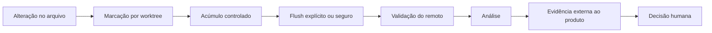

# Estudo de caso — Automação segura de revisão de código

**Estado:** sanitizado  
**Domínio:** manutenção automática de código em múltiplos repositórios  
**Competências:** automação, governança, Git, isolamento e segurança operacional

> Este estudo apresenta o desenho geral da solução. Repositórios, nomes internos, código, dados e detalhes proprietários não são publicados.

## Problema

Um fluxo de revisão produzia diagnósticos úteis, mas dependia de acompanhamento manual para perceber alterações, executar nova análise e manter evidências organizadas.

Automatizar esse processo parecia simples até considerar os riscos:

- executar no repositório errado;
- confundir a raiz do workspace com um produto;
- misturar branches ou worktrees;
- deixar caches e logs dentro dos projetos;
- disparar revisões incompletas durante uma sequência de alterações;
- permitir que um processo antigo interfira em uma sessão nova;
- transformar uma automação auxiliar em autoridade sobre o código.

## Objetivo

Criar uma camada de manutenção que pudesse observar alterações e preparar revisões sem perder três propriedades:

1. **isolamento** — cada worktree mantém seu próprio estado;
2. **autorização** — apenas repositórios explicitamente reconhecidos podem ser processados;
3. **controle humano** — ações destrutivas, merges e resolução de discussões não são automáticos.

## Arquitetura conceitual



## Decisões principais

### Estado por worktree

O caminho do repositório principal não basta para identificar a unidade de trabalho. Branches simultâneas precisam de filas, locks e registros independentes.

### Autorização pelo remoto canônico

Nomes de diretório podem ser copiados ou alterados. A autorização considera o remoto Git normalizado e uma lista explícita de produtos reconhecidos.

### Zero estado operacional nos repositórios filhos

Caches, locks, PIDs e logs ficam em diretórios de estado do usuário, fora dos produtos. A automação não deve produzir sujeira nem alterar o contrato de cada repositório.

### Marcar antes de processar

Eventos frequentes não devem disparar análises completas imediatamente. A estratégia de marcação e flush permite agrupar alterações relacionadas e reduzir trabalho redundante.

### Fonte de verdade no Git

Relatórios e handoffs ajudam, mas não substituem a verificação do HEAD, da branch, do remoto e do conteúdo real dos arquivos.

## Invariantes de segurança

```text
1. Nenhum repositório é processado sem autorização pelo remoto.
2. Nenhum estado é compartilhado entre worktrees diferentes.
3. Nenhuma evidência operacional é gravada dentro do produto.
4. Nenhum merge ou resolução de discussão acontece sem autorização explícita.
5. Nenhum relato intermediário substitui a leitura do estado atual.
```

## Estratégia de entrega

A automação foi dividida em capacidades independentes:

- marcar arquivo alterado;
- marcar atividade de shell;
- acumular estado;
- executar flush;
- consultar status;
- validar repositório e worktree;
- registrar evidências;
- posteriormente, observar mudanças com limites operacionais.

Essa decomposição permite testar cada comportamento sem ativar um processo contínuo antes de os mecanismos de segurança estarem consolidados.

## Riscos tratados

- allowlist incorreta por documentação desatualizada;
- colisão de locks;
- PID órfão;
- análise de branch diferente da esperada;
- execução na raiz de governança;
- loops produzidos pela própria automação;
- revisão disparada com alterações ainda incompletas;
- dependência de nomes locais não confiáveis.

## Resultado arquitetural

A solução deixa de ser um script que “roda quando algo muda” e passa a ser um protocolo operacional verificável:

```text
identificar → autorizar → isolar → acumular → analisar → registrar → decidir
```

## Aprendizado

Automação confiável não é a que faz mais coisas sem intervenção. É a que consegue provar o contexto em que atua, limitar seus efeitos e devolver decisões importantes ao responsável humano.
