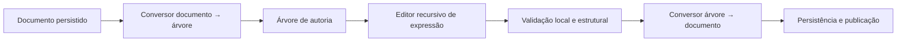

# Estudo de caso — Editor visual de regras

**Estado:** sanitizado  
**Domínio:** autoria de regras de negócio  
**Competências:** modelagem, arquitetura front-end, contratos e interação

> Este estudo descreve padrões e decisões gerais. Nomes, código, dados, métricas e detalhes proprietários foram removidos.

## Problema

Regras de negócio originalmente representadas como documentos estruturados precisavam ser editadas por meio de uma interface visual.

O desafio não era apenas desenhar formulários. A solução precisava preservar:

- a semântica do documento;
- expressões recursivas;
- compatibilidade com regras existentes;
- navegação por mouse e teclado;
- estados de visualização e edição;
- validação por nó e do documento completo;
- publicação segura sem perda de alterações.

## Minha responsabilidade

Minha atuação concentrou-se em transformar conhecimento disperso em um modelo executável:

- mapear estados e transições da interface;
- separar seleção, foco, edição e persistência;
- definir contratos entre árvore visual e documento;
- registrar decisões arquiteturais;
- organizar entregas incrementais;
- revisar riscos de compatibilidade e estado sujo;
- alinhar comportamento de interface, API e testes.

## Modelo conceitual

## Decisões importantes

### 1. A árvore é a superfície principal

O editor deve acontecer no contexto do nó. Painéis laterais podem apoiar diagnóstico e desenvolvimento, mas não devem se tornar uma segunda arquitetura funcional.

### 2. Expressões exigem recursão simétrica

A mesma estrutura deve representar atributos, constantes, operadores e expressões compostas em ambos os lados de uma comparação.

### 3. Seleção, foco e edição são estados diferentes

Misturá-los em um único identificador produz comportamento inconsistente. O alvo focado deve ser tipado e navegar por níveis explícitos.

### 4. O documento persistido continua sendo um contrato

A interface não pode impor silenciosamente uma estrutura incompatível com regras existentes. Conversores e testes de round-trip protegem esse limite.

### 5. Salvar e publicar são intenções diferentes

A autoria precisa preservar trabalho intermediário sem transformar toda alteração em uma nova versão operacional.

## Estratégia de evolução

A implementação foi decomposta em fatias verificáveis:

1. leitura e conversão do documento;
2. árvore navegável;
3. edição local por nó;
4. expressões recursivas;
5. validação;
6. persistência de rascunho;
7. publicação;
8. compatibilidade e regressão.

Cada fatia precisava possuir contrato, teste e critério de aceite próprios.

## Riscos tratados

- perda de alterações ao trocar o documento ativo;
- divergência entre comportamento do mouse e do teclado;
- estados impossíveis produzidos por booleanos independentes;
- conversão não reversível entre árvore e documento;
- campos novos vazando para consumidores legados;
- interface visual sugerindo suporte que a execução não oferece;
- acoplamento entre salvar, validar e publicar.

## Resultado arquitetural

O principal resultado não foi um componente isolado. Foi um modelo no qual:

- o domínio possui representação explícita;
- a interação pode ser testada como transições;
- contratos delimitam front-end e back-end;
- decisões permanecem rastreáveis;
- compatibilidade é verificada, não presumida;
- novas capacidades podem ser adicionadas sem reescrever a base.

## Aprendizado

Editores visuais de domínio não são formulários maiores. São linguagens de autoria. Precisam de gramática, estados, contratos e mecanismos de validação tão rigorosos quanto qualquer linguagem textual.
