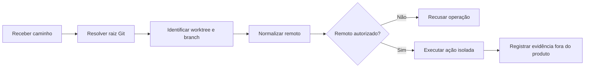

# Polyrepos e worktrees sem perder governança

**Estado:** em cultivo  
**Tema:** Git, ambientes de desenvolvimento e organização operacional

Projetos formados por vários repositórios exigem uma distinção clara entre o código de cada produto e a camada de trabalho usada para coordená-los.

Sem essa separação, scripts, caches, registros operacionais e documentação transversal acabam contaminando os repositórios dos produtos.

## Modelo de responsabilidade

```text
workspace/
├── governanca/          # decisões, contratos e automações transversais
├── produto-a/           # repositório independente
├── produto-b/           # repositório independente
└── produto-c/           # repositório independente
```

A camada de governança conhece os produtos. Os produtos não devem depender da existência dessa camada para compilar, testar ou executar.

## Princípio de isolamento

Cada repositório filho deve preservar:

- seu próprio histórico;
- seu próprio remoto;
- suas próprias regras de contribuição;
- sua própria estratégia de release;
- seus comandos de validação;
- sua capacidade de funcionar de modo independente.

A coordenação transversal pode manter:

- índices e mapas de contexto;
- ADRs compartilhadas;
- automações de inspeção;
- scripts de orquestração;
- contratos entre produtos;
- evidências de revisão.

## Worktrees como unidade de trabalho

Worktrees permitem manter diferentes branches do mesmo repositório simultaneamente sem cópias manuais.

```bash
git worktree add ../worktrees/produto-a/feature-x -b feature/x develop
```

Cada worktree deve possuir identidade operacional própria:

```text
repositório + branch + caminho absoluto + remoto autorizado
```

Essa tupla evita que uma automação execute ações no diretório ou projeto errado.

## Estado operacional fora dos produtos

Arquivos produzidos pela automação não pertencem ao código do produto:

- caches;
- locks;
- PIDs;
- filas locais;
- logs;
- snapshots temporários;
- marcas de arquivos alterados.

Uma estratégia possível:

```text
~/.local/state/minha-automacao/
├── worktrees/
├── locks/
├── logs/
└── cache/
```

## Autorização pelo remoto

Confiar apenas no nome da pasta é frágil. Antes de executar uma operação, valide o remoto Git canônico.

```bash
git remote get-url origin
```

A autorização deve considerar normalização de protocolos equivalentes, como SSH e HTTPS, mas rejeitar repositórios apenas parecidos.

## Regras de segurança

1. Não inferir o produto apenas pelo caminho.
2. Não compartilhar locks entre worktrees diferentes.
3. Não gravar estado operacional dentro dos repositórios filhos.
4. Não executar automações destrutivas sem autorização explícita.
5. Não tratar documentação como fonte de verdade quando o Git pode confirmar o estado real.
6. Não misturar alterações de produtos diferentes no mesmo commit transversal.

## Fluxo mínimo de validação



---

A automação é confiável quando consegue provar onde está, em qual branch atua e para qual repositório remoto produzirá efeitos.
